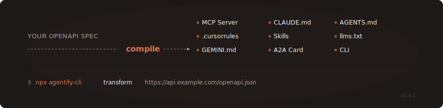

<div align="center">

<h1>Agentify</h1>
<p><strong>Agent Interface Compiler</strong> — One command. Every agent speaks your product.</p>



<br>

<a href="https://www.npmjs.com/package/agentify-cli"></a>
<a href="https://github.com/koriyoshi2041/agentify/actions"></a>
<a href="https://github.com/koriyoshi2041/agentify/blob/main/LICENSE"></a>
<a href="https://www.typescriptlang.org/"></a>

</div>

---

Agentify compiles any OpenAPI specification into **9 agent interface formats** — MCP Server, CLAUDE.md, AGENTS.md, .cursorrules, Skills, llms.txt, GEMINI.md, A2A Card, and CLI. Instead of hand-building each format separately, generate them all from a single source of truth.

```bash
npx agentify-cli transform https://petstore.swagger.io/v2/swagger.json
```

<p align="center">
  
</p>

## The Problem

AI agents are the new users of your API. But making your product agent-accessible requires building and maintaining multiple interface formats:

| Format | Who consumes it | Manual effort |
|--------|----------------|---------------|
| MCP Server | Claude, ChatGPT, Copilot | Days of coding |
| CLAUDE.md | Claude Code | Write from scratch |
| AGENTS.md | Codex, Copilot, Cursor, Gemini CLI | Write from scratch |
| .cursorrules | Cursor IDE | Write from scratch |
| Skills | 30+ agent platforms | Per-platform work |
| llms.txt | LLM search engines | Manual authoring |
| GEMINI.md | Gemini CLI | Write from scratch |
| A2A Card | Google Agent-to-Agent protocol | JSON schema work |
| CLI | Developers, scripts, CI/CD | Build from scratch |

**That's 9+ formats to build, test, and keep in sync.** Every API change means updating all of them.

## The Solution

Agentify is a compiler. OpenAPI in, every agent format out.

```
                    +---> MCP Server (with Dockerfile)
                    |
                    +---> CLAUDE.md
                    |
                    +---> AGENTS.md
                    |
OpenAPI Spec -----> +---> .cursorrules
                    |
                    +---> Skills
                    |
                    +---> llms.txt
                    |
                    +---> GEMINI.md
                    |
                    +---> A2A Card
                    |
                    +---> CLI (standalone command-line tool)
```

## Quick Start

```bash
# Transform any OpenAPI spec
npx agentify-cli transform https://petstore.swagger.io/v2/swagger.json

# Specify output directory
npx agentify-cli transform ./my-api.yaml -o ./output

# Override project name
npx agentify-cli transform https://api.example.com/openapi.json -n my-project

# Generate only specific formats
npx agentify-cli transform ./my-api.yaml -f mcp claude.md

# Generate a standalone CLI tool from your API
npx agentify-cli transform ./my-api.yaml -f cli -o my-api-cli

# Get Agentify's own agent interface files (self-describe)
npx agentify-cli self-describe -o .
```

**Output:**

```
  Agentify v0.4.0
  Agent Interface Compiler

  +-- 20 endpoints detected -> SMALL API strategy
  +-- 3 domains identified (pet, store, user)
  +-- Auth: apiKey (SWAGGER_PETSTORE_API_KEY)
  +-- Strategy: Direct tool mapping — one tool per endpoint

  > Generated mcp + claude.md + agents.md + cursorrules + llms.txt + gemini.md + skills + a2a (15 files)
  > Output: ./swagger-petstore-mcp-server
  > Security scan: PASSED
```

## Features

**Smart Strategy Selection** — Automatically chooses the right generation strategy based on API size:

| API Size | Endpoints | Strategy | Why |
|----------|-----------|----------|-----|
| Small | < 30 | Direct mapping | One tool per endpoint, simple and complete |
| Medium | 30-100 | Direct mapping (Tool Search planned) | Detects scale; optimized generation coming soon |
| Large | 100+ | Direct mapping (Code Exec planned) | Detects scale; context-optimized generation coming soon |

**Security First** — Every generated artifact passes through:
- Input sanitization (blocks eval, exec, Function constructor, require/import injection)
- Handlebars template injection prevention
- Prompt injection pattern detection
- Generated code security scanning

**Production Ready** — Generated MCP servers include:
- TypeScript source with full type safety
- Dockerfile for containerized deployment
- Environment variable configuration (.env.example)
- Stdio transport (standard MCP protocol)

## Output Format Status

| Format | Status | Description |
|--------|--------|-------------|
| MCP Server | Available | Full server with tools, handlers, Dockerfile |
| CLAUDE.md | Available | Project context for Claude Code |
| AGENTS.md | Available | Universal agent instructions (Linux Foundation standard) |
| .cursorrules | Available | Cursor IDE agent rules |
| Skills | Available | Structured capability file for agent platforms |
| llms.txt | Available | LLM-readable condensed documentation |
| GEMINI.md | Available | Gemini CLI project context |
| A2A Card | Available | Google Agent-to-Agent discovery card |
| CLI | Available | Standalone command-line tool (opt-in: `-f cli`) |

## How It Works

```
1. PARSE        OpenAPI 3.x / Swagger 2.0 spec (URL or file)
                  |
2. SANITIZE     Strip dangerous patterns from all spec fields
                  |
3. ANALYZE      Detect domains, auth, scale -> pick strategy
                  |
4. COMPILE      Generate AgentifyIR (intermediate representation)
                  |
5. EMIT         Run selected emitters (MCP, Skills, Docs, etc.)
                  |
6. SCAN         Security scan all generated code
                  |
7. OUTPUT       Write files to disk
```

**AgentifyIR** is the canonical intermediate representation — a flat, typed structure that captures everything an emitter needs: product metadata, capabilities (endpoints), domains, auth config, and generation strategy.

## Architecture

```
agentify/
+-- src/
|   +-- cli.ts              # CLI entry point (Commander.js)
|   +-- parser/             # OpenAPI parsing + input sanitization
|   +-- generator/          # Pluggable emitters for each format
|   |   +-- templates/      # Handlebars templates
|   +-- security/           # Input sanitization + output scanning
|   +-- types.ts            # AgentifyIR type definitions
+-- templates/              # Generated project templates
+-- test/                   # Vitest test suite
```

## Contributing

Agentify welcomes contributions, especially **new emitters** (output formats). Each emitter implements a simple interface:

```typescript
import type { Emitter, AgentifyIR, EmitterOptions, EmitterResult } from "../types";

export class MyFormatEmitter implements Emitter {
  readonly name = "my-format";
  readonly format = "my-format";

  async emit(ir: AgentifyIR, options: EmitterOptions): Promise<EmitterResult> {
    // Generate output files from the IR
    return { filesWritten: [...], warnings: [] };
  }
}
```

See [CONTRIBUTING.md](CONTRIBUTING.md) for the full guide.

## Roadmap

- [x] **M0: Foundation** — OpenAPI parser, MCP emitter, security scanner, CLI
- [x] **M1: Multi-Format** — ~~CLAUDE.md~~, ~~AGENTS.md~~, ~~Skills~~, ~~.cursorrules~~, ~~llms.txt~~, ~~GEMINI.md~~, ~~A2A Card~~
- [ ] **M2: Intelligence** — Capability graph, semantic grouping, context optimization
- [ ] **M3: Self-Serve** — Web UI, one-click deploy, registry integrations
- [ ] **M4: Scale** — Enterprise features, custom emitters, CI/CD integration

## Compared to Alternatives

| Feature | Agentify | Speakeasy | Stainless | openapi-to-skills |
|---------|----------|-----------|-----------|-------------------|
| MCP Server | Yes | Yes | No | No |
| Skills | Yes | CLI only | No | Yes |
| CLAUDE.md | Yes | No | No | No |
| AGENTS.md | Yes | No | No | No |
| .cursorrules | Yes | No | No | No |
| llms.txt | Yes | Yes | No | No |
| GEMINI.md | Yes | No | No | No |
| A2A Card | Yes | No | No | No |
| CLI generation | Yes | No | No | No |
| Self-as-Skills | Yes | No | No | No |
| Context-aware strategy | Yes | No | Yes | No |
| Security scanning | Yes | Unknown | Unknown | No |
| Open source | MIT | No | No | MIT |

**No existing tool compiles one OpenAPI spec into all agent interface formats.**

## License

[MIT](LICENSE) -- Agentify Contributors
